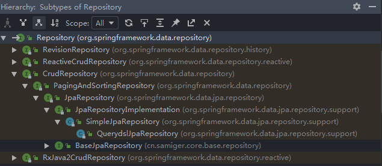

# Spring Data JPA 原理与实战

> - [中文文档](https://www.docs4dev.com/docs/zh/spring-data-jpa/2.1.5.RELEASE/reference)  
> - [拉勾教育-Spring Data JPA 原理与实战](https://kaiwu.lagou.com/course/courseInfo.htm?courseId=490#/content?courseId=490)

## 初识

### JPA 与 ORM

JPA 是 Java Persistence API 的简称，中文名叫 Java 持久层 API， 是 JDK 5.0 新增的*协议*，通过相关持久层注解（@Entity 等）来描述对象和关系表的映射关系，并将项目运行期的实体对象，通过一种Session持久化到数据库中。

ORM 即对象关系映射，是 Object Relational Mapping 的简称。

两者的关系为：

### Spring Data 介绍

Spring Data 利用一个一致的、基于“注解”的数据访问编程模型，做一些公共操作的封装，它可以轻松地让开发者使用数据库访问技术，包括关系数据库、非关系数据库（NoSQL）。同时又有不同的数据框架的实现，保留了每个底层数据存储结构的特殊特性。

Spring Data Common 是 Spring Data 所有模块的公共部分，该项目提供了基于 Spring 的共享基础设施，定义了很多公用的接口和一些相对数据操作的公共实现（如分页排序、结果映射、Autiting 信息、事务等）。

Spring Data JPA 就是 Spring Data Common 的关系型数据库的查询实现。

## Spring Data Common 之 Repository

### spring-boot-starter-data-jpa 的依赖关系

通过上图，不难发现，数据库连接用的是 JDBC，连接池用的是 HikariCP，强依赖 Hibernate；Spring Boot Starter Data JPA 依赖 Spring Data JPA；而 Spring Data JPA 依赖 Spring Data Commons。

### Repository 接口

Repository 接口 是 Spring Data 存储库抽象中的中央接口，是 Spring Data Common 里面的顶级父类接口。

#### Repository 类层次关系

通过该层次结构视图，你就会明白基类 Repository 的用意，由此可知，存储库分为以下 4 个大类。

- ReactiveCrudRepository 这条线是响应式编程，主要支持当前 NoSQL 方面的操作，因为这方面大部分操作都是分布式的
- RxJava2CrudRepository 这条线是为了支持 RxJava 2 做的标准响应式编程的接口
- CrudRepository 这条继承关系链正是我们要详细了解的 JPA 相关的操作接口。

#### 7 个重点 Repository 接口

- Repository 没有暴露任何方法
- CrudRepository 简单的 Curd 方法
- PagingAndSortingRepository 带分页和排序的查询方法
- JpaRepository JPA 的扩展方法
- JpaSpecificationExecutor JPA 的 Specification 查询
- QueryByExampleExecutor 简单 Example 查询
- QueryDslPredicateExecutor QueryDsl 的封装

#### 两个重点 Repository 实现类

- SimpleJpaRepository 上述 7 个重要接口（除 QueryDslPredicateExecutor 外）的默认实现类；
- QuerydslJpaPredicateExecutor (QueryDslJpaRepository 已不被推荐使用)

TODO：看到了原文的 "你会发现在进行 Update、Delete、Insert 等操作之前" 这里
